# Home Workout — Fitness Trainer

> A production-grade Android fitness application built in Kotlin, featuring structured workout plans, real-time exercise tracking, custom training creation, and a subscription-based monetization model via Google Play Billing.

---

## Table of Contents

- [Overview](#overview)
- [Demo](#demo)
- [Screenshots](#screenshots)
- [Tech Stack](#tech-stack)
- [Architecture](#architecture)
- [Features](#features)
- [Monetization](#monetization)
- [Project Structure](#project-structure)
- [Getting Started](#getting-started)
- [Build Variants](#build-variants)
- [Known Debt & Roadmap](#known-debt--roadmap)

---

## Overview

Home Workout is a fully offline-capable fitness app that ships with a pre-populated SQLite database of curated workout plans and exercises. Users can follow structured plans, build custom training routines, track workout history, monitor health metrics, and set reminders — all without requiring a backend account.

**Scale:**
- 205 Kotlin/Java source files
- 37 Activities across 95 XML layouts
- 3 Gradle modules (`app`, `MPChartLib`, `horizontal-picker`)
- Supports Android 7.0+ (API 24–35)

---

## Demo

https://github.com/user-attachments/assets/9e7bfc3a-ddc9-456b-a092-5d91827213eb

---

## Screenshots

<table>
  <tr>
    <td align="center"><b>Splash</b></td>
    <td align="center"><b>Home</b></td>
    <td align="center"><b>Nav Drawer</b></td>
    <td align="center"><b>30-Day Plan</b></td>
  </tr>
  <tr>
    <td>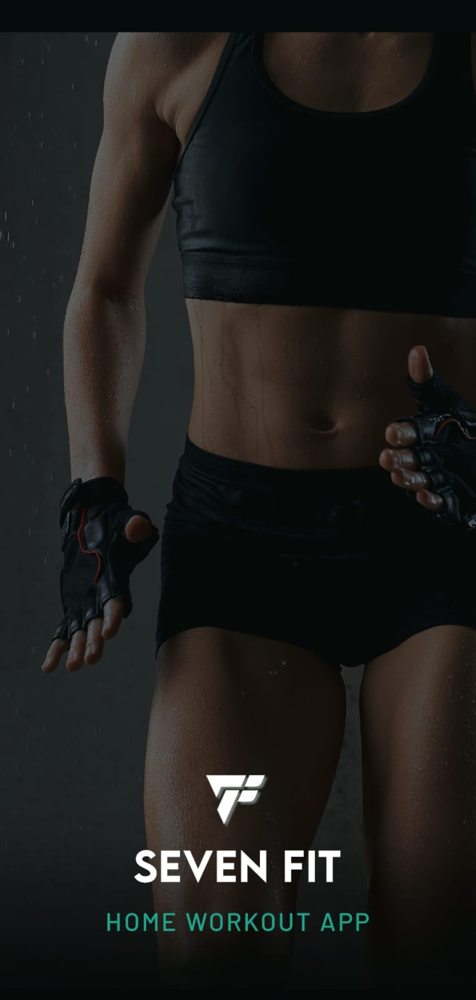</td>
    <td>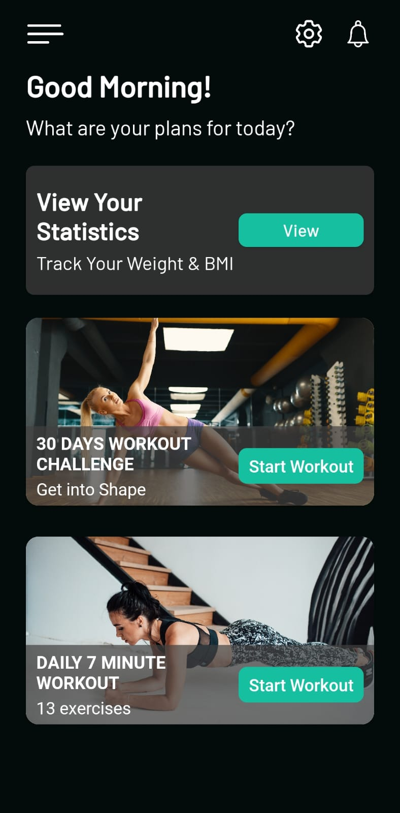</td>
    <td>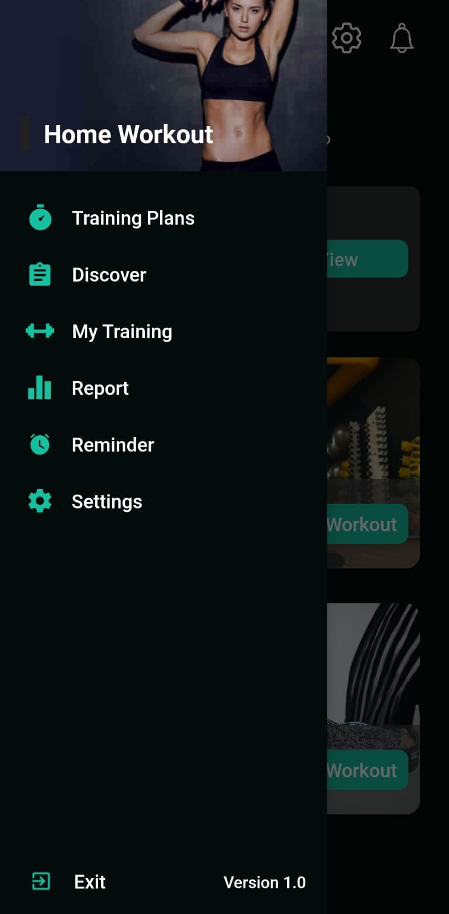</td>
    <td>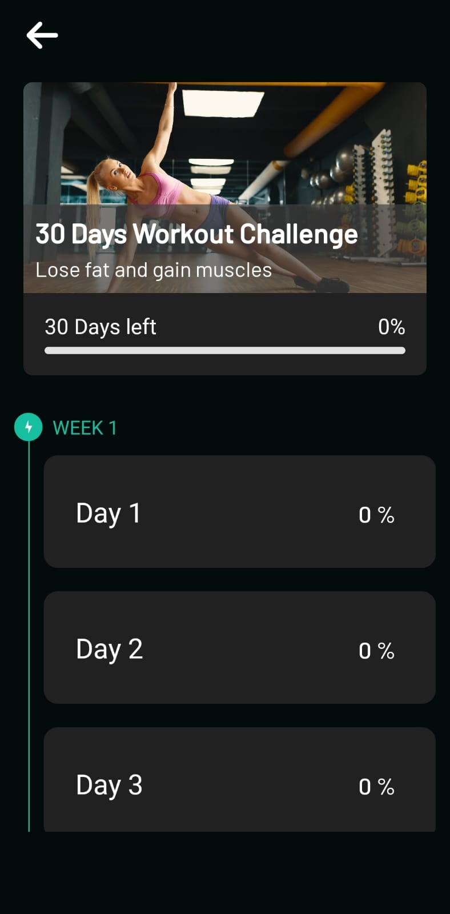</td>
  </tr>
  <tr>
    <td align="center"><b>Day View</b></td>
    <td align="center"><b>Exercise List</b></td>
    <td align="center"><b>Exercise Detail</b></td>
    <td align="center"><b>Rest Timer</b></td>
  </tr>
  <tr>
    <td>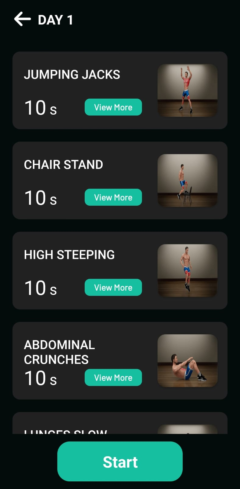</td>
    <td>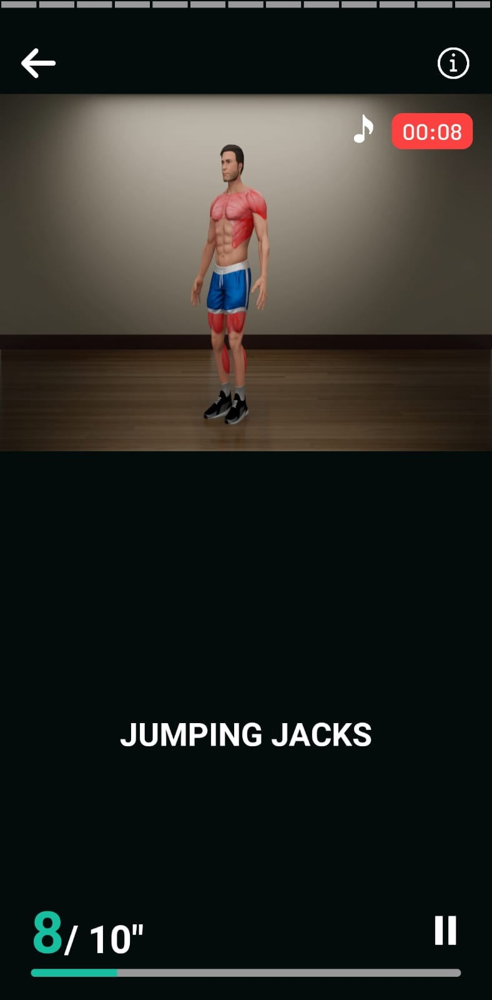</td>
    <td>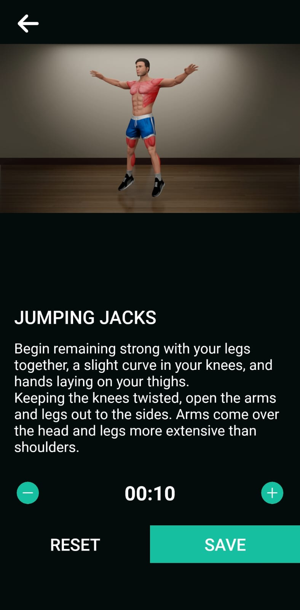</td>
    <td>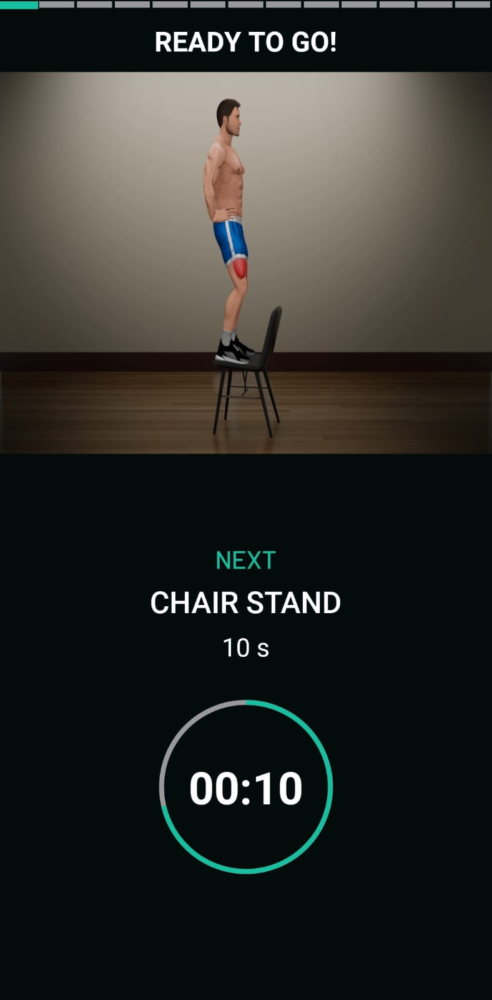</td>
  </tr>
  <tr>
    <td align="center"><b>Records</b></td>
    <td align="center"><b>Report</b></td>
    <td align="center"><b>Settings</b></td>
    <td></td>
  </tr>
  <tr>
    <td>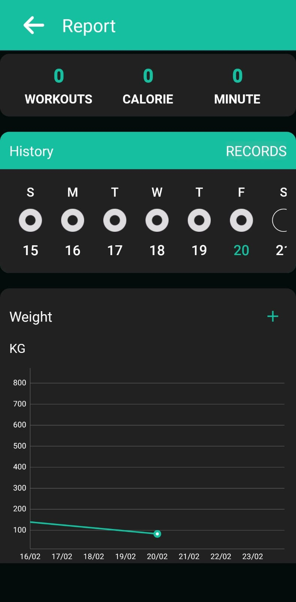</td>
    <td>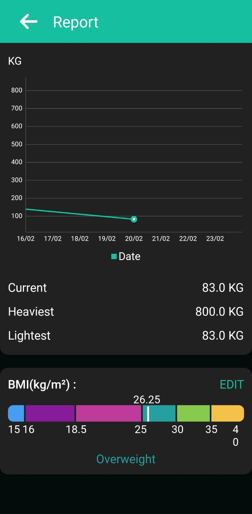</td>
    <td>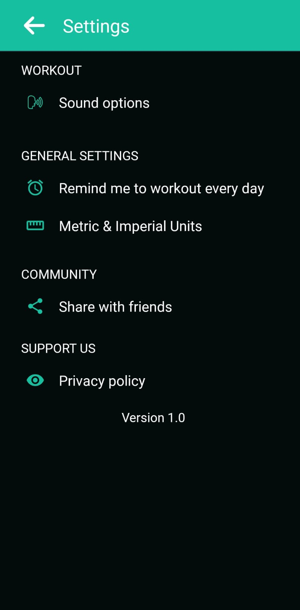</td>
    <td></td>
  </tr>
</table>

---

## Tech Stack

| Category | Library / Tool | Version |
|---|---|---|
| Language | Kotlin | 1.9.0 |
| Build System | Android Gradle Plugin | 8.6.1 |
| Min SDK / Target SDK | — | 24 / 34 |
| UI | Data Binding, Material Components | 1.12.0 |
| Responsive Sizing | SDP / SSP (Intuit) | 1.1.0 |
| Animations | Lottie | 3.4.4 |
| Image Loading | Glide | 4.13.0 |
| Networking | Retrofit 2 + OkHttp | 2.9.0 / 4.11.0 |
| Serialization | Gson | 2.11.0 |
| Database | SQLite (pre-populated, via `DataHelper`) | — |
| Charts | MPAndroidChart (local module) | — |
| Billing | Google Play Billing KTX | 7.1.1 |
| Push Notifications | Firebase Cloud Messaging | 24.1.0 |
| Background Work | WorkManager KTX | 2.10.0 |
| Permissions | Dexter | 6.2.1 |
| Navigation Drawer | MaterialDrawer | 6.1.2 |
| Image Cropper | Android Image Cropper | 4.6.0 |

---

## Architecture

The application uses an **Activity + Repository pattern** with Android Data Binding. This was a deliberate choice for a content-heavy, offline-first app where the overhead of a full MVVM + DI setup would outweigh the benefit given the stable, pre-defined data model.

```
┌─────────────────────────────────────────────┐
│                  UI Layer                   │
│  BaseActivity → 37 Activities + Fragments   │
│  Data Binding (XML ↔ View state)            │
└──────────────────┬──────────────────────────┘
                   │
┌──────────────────▼──────────────────────────┐
│              Domain / Data Layer            │
│  DataHelper (SQLite)  ←→  SharedPreferences │
│  Google Play Billing (subscriptions)        │
│  WorkManager (background tasks)             │
└─────────────────────────────────────────────┘
```

### Key Design Decisions

- **Offline-first**: All workout plans, exercises, and user data are stored locally in a pre-populated SQLite database (`StretchingEx.db` in assets). Zero account required.
- **BaseActivity**: A single base class handles cross-cutting concerns — navigation drawer setup, top bar, screen-on lock, locale switching, and dialog management. Keeps individual Activities focused on their feature.
- **Callback interfaces over LiveData**: Given the Activity-to-Activity navigation model (no Fragment back stack), direct callback interfaces reduce unnecessary observer lifecycle management.
- **Pre-populated DB strategy**: Exercise content ships inside the APK. This removes dependency on a content API, keeps the app fully functional with no network, and avoids cold-start latency for content loading.

---

## Features

### Workout Core
- **Structured Plans** — Beginner / Intermediate / Advanced plans with day-by-day breakdowns
- **Active Workout Screen** — Real-time countdown timer, rest periods, audio cues (voice guide + coach tips), exercise replacement
- **Exercise Library** — 200+ exercises with video demonstrations and written descriptions
- **Custom Training Builder** — Create, name, and manage personal workout routines with any exercise combination
- **Sub-Plan System** — Hierarchical plan structure (`HasSubPlan` flag) for multi-week progressions

### Progress & Health
- **Workout History** — Full log of completed sessions with duration, calories, and feel rating
- **Report Charts** — Weekly/monthly workout analytics using MPAndroidChart
- **Weight & BMI Tracking** — Log weight entries with unit support (KG/LB) and trend visualization
- **Health Data** — Store height, gender, year of birth for personalized calorie estimates

### User Experience
- **Discover** — Browse content by category: Pain Relief, Flexibility, Fat Burning, Body Focus, Training, Posture Correction
- **Background Music** — Select from bundled tracks during workouts (premium tracks gated behind subscription)
- **TTS Voice Guide** — Configurable Text-to-Speech engine for exercise instructions
- **Reminders** — AlarmManager-based reminders that survive device reboot via `BootReceiver`
- **Multi-language Support** — Runtime locale switching via `LocaleManager`
- **Responsive Layouts** — SDP/SSP ensures consistent sizing across all screen densities

### Notifications
- Firebase Cloud Messaging integration
- Topic subscription: `home_workout`
- Local notification scheduling via WorkManager

---

## Monetization

The app uses a **freemium subscription model** via Google Play Billing Library v7.1.1.

### Subscription Tiers

| Plan | SKU | Price |
|---|---|---|
| Monthly | `99monthlysubscription` | $0.99 / month |
| Yearly | `499yearlysubscription` | $4.99 / year |

### What's Gated

| Feature | Free | Premium |
|---|---|---|
| Standard workout plans | ✅ | ✅ |
| Premium plans (`isPro = true`) | ❌ | ✅ |
| Sub-plan progressions | ❌ | ✅ |
| Premium music tracks | ❌ | ✅ |
| Ad-free experience | ❌ | ✅ |

### Implementation Notes

- Purchase status stored in `SharedPreferences` (`KeyPurchaseStatus`) and checked at every premium entry point
- `AccessAllFeaturesActivity` handles the full billing flow: SKU query → price display → `launchBillingFlow()` → purchase acknowledgement
- Debug override: `Debug.DEBUG_IS_PURCHASE = true` unlocks all premium features for local testing without a Play Store purchase

---

## Project Structure

```
app/src/main/
├── java/fitnessapp/workout/homeworkout/
│   ├── stretching/
│   │   ├── [38 Activity files]        # One Activity per screen
│   │   ├── adapter/                   # 31 RecyclerView adapters
│   │   ├── objects/                   # 24 data model classes
│   │   ├── utils/                     # Constant, Debug, Utils, MusicUtil, etc.
│   │   ├── db/DataHelper.kt           # SQLite access layer
│   │   ├── interfaces/                # Callback contracts
│   │   ├── viewmodel/                 # Lightweight ViewModels
│   │   ├── network/                   # Retrofit client setup
│   │   ├── pushnotification/          # FCM service
│   │   ├── fragments/                 # Fragment classes
│   │   └── discover/                  # Discover feature module
│   ├── compactcalender/               # Calendar widget
│   └── view/                          # Custom Views
├── res/
│   ├── layout/                        # 95 XML layouts
│   ├── values/                        # strings, colors, styles
│   └── raw/                           # Bundled audio assets
└── assets/
    └── StretchingEx.db                # Pre-populated SQLite database
```

### Database Tables

| Table | Purpose |
|---|---|
| `HomePlanTable` | Workout plans with `isPro`, `hasSubPlan` flags |
| `ExerciseTable` | Full exercise library with video paths |
| `PlanDaysTable` | Day-by-day plan structure |
| `HistoryTable` | Completed workout log |
| `WeightTable` | Weight entries with timestamps |
| `ReminderTable` | Scheduled reminder configuration |
| `MusicTable` | Bundled music tracks with `isPro` flag |
| `MyTrainingCategoryTable` | User-created training categories |

---

## Getting Started

### Prerequisites

- Android Studio Hedgehog or later
- JDK 17+
- Android SDK with API level 24–35

### Setup

```bash
# Clone the repository
git clone <repo-url>
cd "Home Workout V2"

# Open in Android Studio
# File → Open → select the project root
```

> **Note:** `local.properties` is excluded from version control (contains your local SDK path). Android Studio regenerates it automatically on first sync.

### Configure Billing (for testing)

1. Upload the app to Google Play Internal Testing track
2. Add test account email in Play Console → License Testing
3. Replace SKUs in `AccessAllFeaturesActivity.kt` if you use your own product IDs

### Debug Flags

Located in [`utils/Debug.kt`](app/src/main/java/fitnessapp/workout/homeworkout/stretching/utils/Debug.kt):

```kotlin
val DEBUG = true                  // Enable verbose logging
val DEBUG_IS_PURCHASE = false     // Set true to simulate premium state locally
```

---

## Build Variants

| Variant | Minify | Notes |
|---|---|---|
| `debug` | No | Full logging, debug billing |
| `release` | No (ProGuard config present) | Enable `isMinifyEnabled = true` before publishing |

> **Before publishing to Play Store:**
> 1. Set `isMinifyEnabled = true` in `app/build.gradle.kts`
> 2. Set `Debug.DEBUG = false`
> 3. Ensure `Debug.DEBUG_IS_PURCHASE = false`

---

## Known Debt & Roadmap

This section reflects honest engineering trade-offs — the gap between what works in production and what a greenfield build would look like today.

### Current Technical Debt

| Area | Current State | Ideal State |
|---|---|---|
| Architecture | Activity + Repository + Callbacks | MVVM with StateFlow / MVI |
| DI | Manual instantiation | Hilt |
| Navigation | Direct `Intent` calls | Navigation Component |
| Background work | Mix of `AlarmManager` + `WorkManager` | Unified `WorkManager` |
| DB access | Direct SQLite helper on main thread in places | Room with coroutines |
| Kotlin idioms | Some Java-style patterns remain | Idiomatic Kotlin with coroutines |

### Roadmap

- [ ] Migrate data layer to **Room** with coroutine-based DAOs
- [ ] Introduce **Hilt** for dependency injection
- [ ] Refactor core flows to **MVVM + StateFlow**
- [ ] Add **Navigation Component** for in-app navigation graph
- [ ] Expand **unit test coverage** for `DataHelper` and billing flow
- [ ] Integrate **Firebase Crashlytics** for production error tracking
- [ ] Add **widget support** for quick workout start from home screen

---

## License

This project is proprietary. All rights reserved.

---

_Built with Kotlin · Android SDK 35 · Google Play Billing v7.1.1_
